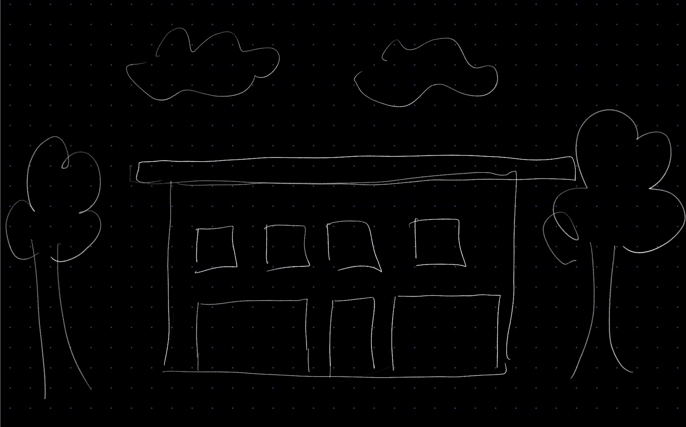

# BIODS 253 Assignment 3

## Setup

1. Clone the repository
2. Run `conda create -n turtle-test python=3.10` and run `conda activate turtle-test`
3. Run `python main.py` in your terminal
4. Watch our house come to life!

## Unit Tests

1. Run `conda install -c conda-forge cairocffi` and `pip install svg-turtle svglib reportlab matplotlib rlPyCairo`
2. Run `drawing_test.py` to ensure all tests pass

## Our process

This was our initial blueprint for the project:

We created a main house frame, then each person worked on their own branch to create a part of the house:

1. 4 windows, 2 garage doors, 1 door
2. 2 trees on either side of the house
3. 2 clouds above the house
